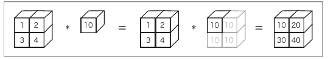
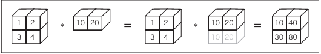

# Deep-Learning

深度学习入门:基于Python的理论与实现

# NumPy

1.在深度学习的实现中，经常出现数组和矩阵的计算。NumPy的数组类（numpy.array）中提供了很多便捷的方法

2.导入NumPy  
import numpy as np

3.生成NumPy数组  
np.array()方法 接收Python列表作为参数，生成NumPy数组（numpy.ndarray）

> > > x = np.array([1.0, 2.0, 3.0])  
> > > print(x)  
> > > [ 1. 2. 3.]  
> > > type(x)  
> > > <class 'numpy.ndarray'>

4.NumPy 的算术运算  
对应元素的乘法

> > > x = np.array([1.0, 2.0, 3.0])  
> > > y = np.array([2.0, 4.0, 6.0])  
> > > x + y # 对应元素的加法  
> > > array([ 3., 6., 9.])  
> > > x - y  
> > > array([ -1., -2., -3.])  
> > > x \* y # element-wise product  
> > > array([ 2., 8., 18.])  
> > > x / y  
> > > array([ 0.5, 0.5, 0.5])

和单一的数值（标量）

> > > x = np.array([1.0, 2.0, 3.0])  
> > > x / 2.0  
> > > array([ 0.5, 1. , 1.5])

5.　NumPy的N维数组

> > > A = np.array([[1, 2], [3, 4]])  
> > > print(A)  
> > > [[1 2]  
 [3 4]]  
> > > A.shape # 矩阵A的形状  
> > > (2, 2)  
> > > A.dtype # 矩阵元素的数据类型  
> > > dtype('int64')

广播功能

6.广播

广播的例子：标量10被当作2×2的矩阵

> > > A \* 10  
> > > array([[10, 20],  
 [ 30, 40]])

---

> > > A = np.array([[1, 2], [3, 4]])  
> > > B = np.array([10, 20])  
> > > A \* B  
> > > array([[ 10, 40],

       [ 30, 80]]

# Matplotlib

Matplotlib 是用于绘制图形的库，使用Matplotlib可以轻松地绘制图形和实现数据的可
视化
